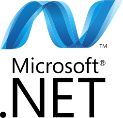

# Notas
Uma base de estudos e registros sobre assuntos estudados, para posterior revisão, caso venha a ser esquecido.   

## C#
C#(pronuncia-se, em inglês, see sharp) é uma linguagem orientada a objetos, e orientada a componentes, fortemente tipada, e com suporte a plataforma de desenvolvimento integrado .NET, que possibilita desenvolver para diversas plataformas.   
 

## Markdown
Uma linguagem de marcação similar ao HTML, que, inclusive, possui suporte para conversão, sendo, portanto, a preferida para blogs, e sites de notícias.  

## WPF
O Windows Presentation Foundation é uma estrutura de interface de usuário que é independente de resolução e usa um mecanismo de renderização baseado em vetor, criado para aproveitar o hardware gráfico moderno.  

O WPF fornece um conjunto abrangente de recursos de desenvolvimento de aplicativos que incluem XAML (eXtensible Application Markup Language), controles, associação de dados, layout, elementos gráficos 2D e 3D, animação, estilos, modelos, documentos mídia, texto e topografia.  
